Obesity Level Predictive Modeling
================
Zachary Cannon, Makayla Harvey, Giancarlo Pantano, Kaylen Ton, Megan
Xiao

### Load packages

``` r
library(tidyverse)
```

    ## ── Attaching core tidyverse packages ──────────────────────── tidyverse 2.0.0 ──
    ## ✔ dplyr     1.1.4     ✔ readr     2.1.6
    ## ✔ forcats   1.0.1     ✔ stringr   1.6.0
    ## ✔ ggplot2   4.0.1     ✔ tibble    3.3.1
    ## ✔ lubridate 1.9.4     ✔ tidyr     1.3.2
    ## ✔ purrr     1.2.1     
    ## ── Conflicts ────────────────────────────────────────── tidyverse_conflicts() ──
    ## ✖ dplyr::filter() masks stats::filter()
    ## ✖ dplyr::lag()    masks stats::lag()
    ## ℹ Use the conflicted package (<http://conflicted.r-lib.org/>) to force all conflicts to become errors

``` r
library(tidymodels)
```

    ## Warning: package 'tidymodels' was built under R version 4.5.3

    ## ── Attaching packages ────────────────────────────────────── tidymodels 1.4.1 ──
    ## ✔ broom        1.0.11     ✔ rsample      1.3.2 
    ## ✔ dials        1.4.2      ✔ tailor       0.1.0 
    ## ✔ infer        1.1.0      ✔ tune         2.0.1 
    ## ✔ modeldata    1.5.1      ✔ workflows    1.3.0 
    ## ✔ parsnip      1.4.1      ✔ workflowsets 1.1.1 
    ## ✔ recipes      1.3.1      ✔ yardstick    1.3.2

    ## Warning: package 'dials' was built under R version 4.5.3

    ## Warning: package 'infer' was built under R version 4.5.3

    ## Warning: package 'modeldata' was built under R version 4.5.3

    ## Warning: package 'parsnip' was built under R version 4.5.3

    ## Warning: package 'rsample' was built under R version 4.5.3

    ## Warning: package 'tailor' was built under R version 4.5.3

    ## Warning: package 'tune' was built under R version 4.5.3

    ## Warning: package 'workflows' was built under R version 4.5.3

    ## Warning: package 'workflowsets' was built under R version 4.5.3

    ## Warning: package 'yardstick' was built under R version 4.5.3

    ## ── Conflicts ───────────────────────────────────────── tidymodels_conflicts() ──
    ## ✖ scales::discard() masks purrr::discard()
    ## ✖ dplyr::filter()   masks stats::filter()
    ## ✖ recipes::fixed()  masks stringr::fixed()
    ## ✖ dplyr::lag()      masks stats::lag()
    ## ✖ yardstick::spec() masks readr::spec()
    ## ✖ recipes::step()   masks stats::step()

``` r
library(vip)
```

    ## Warning: package 'vip' was built under R version 4.5.3

    ## 
    ## Attaching package: 'vip'
    ## 
    ## The following object is masked from 'package:utils':
    ## 
    ##     vi

``` r
library(ggplot2)

# For parallel processing when it comes to tuning multiple models (which can take longer)
library(parallelly)
library(future)
```

    ## Warning: package 'future' was built under R version 4.5.3

``` r
cores <- availableCores(logical = F)
plan(multisession, workers = cores)
```

### Load in and separate normal and synthetic data

``` r
# Load raw data 

raw_data <- read.csv("ObesityData.csv", 
                     stringsAsFactors = FALSE)

cat("Number of rows:", nrow(raw_data),"\n",
    "Number of columns:", ncol(raw_data), "\n\n")
```

    ## Number of rows: 2111 
    ##  Number of columns: 17

``` r
str(raw_data)
```

    ## 'data.frame':    2111 obs. of  17 variables:
    ##  $ Gender                        : chr  "Female" "Female" "Male" "Male" ...
    ##  $ Age                           : num  21 21 23 27 22 29 23 22 24 22 ...
    ##  $ Height                        : num  1.62 1.52 1.8 1.8 1.78 1.62 1.5 1.64 1.78 1.72 ...
    ##  $ Weight                        : num  64 56 77 87 89.8 53 55 53 64 68 ...
    ##  $ family_history_with_overweight: chr  "yes" "yes" "yes" "no" ...
    ##  $ FAVC                          : chr  "no" "no" "no" "no" ...
    ##  $ FCVC                          : num  2 3 2 3 2 2 3 2 3 2 ...
    ##  $ NCP                           : num  3 3 3 3 1 3 3 3 3 3 ...
    ##  $ CAEC                          : chr  "Sometimes" "Sometimes" "Sometimes" "Sometimes" ...
    ##  $ SMOKE                         : chr  "no" "yes" "no" "no" ...
    ##  $ CH2O                          : num  2 3 2 2 2 2 2 2 2 2 ...
    ##  $ SCC                           : chr  "no" "yes" "no" "no" ...
    ##  $ FAF                           : num  0 3 2 2 0 0 1 3 1 1 ...
    ##  $ TUE                           : num  1 0 1 0 0 0 0 0 1 1 ...
    ##  $ CALC                          : chr  "no" "Sometimes" "Frequently" "Frequently" ...
    ##  $ MTRANS                        : chr  "Public_Transportation" "Public_Transportation" "Public_Transportation" "Walking" ...
    ##  $ NObeyesdad                    : chr  "Normal_Weight" "Normal_Weight" "Normal_Weight" "Overweight_Level_I" ...

``` r
head(raw_data)
```

    ##   Gender Age Height Weight family_history_with_overweight FAVC FCVC NCP
    ## 1 Female  21   1.62   64.0                            yes   no    2   3
    ## 2 Female  21   1.52   56.0                            yes   no    3   3
    ## 3   Male  23   1.80   77.0                            yes   no    2   3
    ## 4   Male  27   1.80   87.0                             no   no    3   3
    ## 5   Male  22   1.78   89.8                             no   no    2   1
    ## 6   Male  29   1.62   53.0                             no  yes    2   3
    ##        CAEC SMOKE CH2O SCC FAF TUE       CALC                MTRANS
    ## 1 Sometimes    no    2  no   0   1         no Public_Transportation
    ## 2 Sometimes   yes    3 yes   3   0  Sometimes Public_Transportation
    ## 3 Sometimes    no    2  no   2   1 Frequently Public_Transportation
    ## 4 Sometimes    no    2  no   2   0 Frequently               Walking
    ## 5 Sometimes    no    2  no   0   0  Sometimes Public_Transportation
    ## 6 Sometimes    no    2  no   0   0  Sometimes            Automobile
    ##            NObeyesdad
    ## 1       Normal_Weight
    ## 2       Normal_Weight
    ## 3       Normal_Weight
    ## 4  Overweight_Level_I
    ## 5 Overweight_Level_II
    ## 6       Normal_Weight

``` r
# Save a copy of raw_data with the duplicates for now
df <- raw_data

#Create DF with only real data
problem_cols <- c("Age","FCVC","NCP","CH2O","FAF","TUE")

is_decimal <- function(x){
  !is.na(x) & (x %% 1 != 0)
}

is_not_decimal <- function(x){
  !is.na(x) & (x %% 1 == 0)
}

#if at least one record in problem_cols is a decimal value, save in syn_df
syn_df <- df %>%
  filter(if_any(all_of(problem_cols), is_decimal))
nrow(syn_df)
```

    ## [1] 1596

``` r
#if all records in problem_cols are whole numbers, save in normal_df
normal_df <- df %>%
  filter(if_all(all_of(problem_cols), is_not_decimal))
nrow(normal_df)
```

    ## [1] 515

``` r
#ensure rows add to 2111
nrow(syn_df) + nrow(normal_df)
```

    ## [1] 2111

### EDA: Comparing NObeyesdad between Synthetic data, Real data, and All data

``` r
#histogram of normal_df NObeyesdad
norm_df_count <- normal_df %>%
  count(NObeyesdad) %>%
  arrange(desc(n))

p <- ggplot(norm_df_count, aes(x= NObeyesdad, y = n, fill = NObeyesdad)) +
  geom_col() +
  labs(title = "Counts of Obesity Levels (Normal/Real Data only)",
       x = "Obesity Level",
       y = "Count") +
  theme(axis.text.x = element_text(angle = 45, vjust = 1, hjust = 1))
p
```

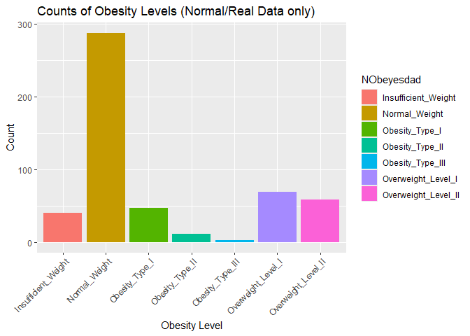<!-- -->

``` r
#most are of "Normal Weight"

syn_df_count <- syn_df %>%
  count(NObeyesdad) %>%
  arrange(desc(n))

p2 <- ggplot(syn_df_count, aes(x=NObeyesdad, y = n, fill = NObeyesdad)) +
  geom_col() +
  labs(title = "Counts of Obesity Levels (Synthetic Data only)",
       x = "Obesity Level",
       y = "Count") +
  theme(axis.text.x = element_text(angle = 45, vjust = 1, hjust = 1))
p2
```

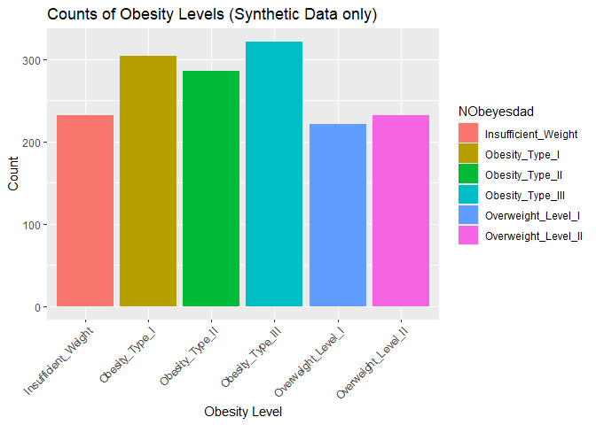<!-- -->

``` r
#classes are balanced, but no "Normal Weight"

df_count <- df %>%
  count(NObeyesdad) %>%
  arrange(desc(n))

p3 <- ggplot(df_count, aes(x=NObeyesdad, y=n, fill=NObeyesdad))+
  geom_col() +
  labs(title = "Counts of Obesity Levels (All Rows - Normal/Read + Synthetic)",
       x = "Obesity Level",
       y = "Count") +
  theme(axis.text.x = element_text(angle = 45, vjust = 1, hjust = 1))
p3
```

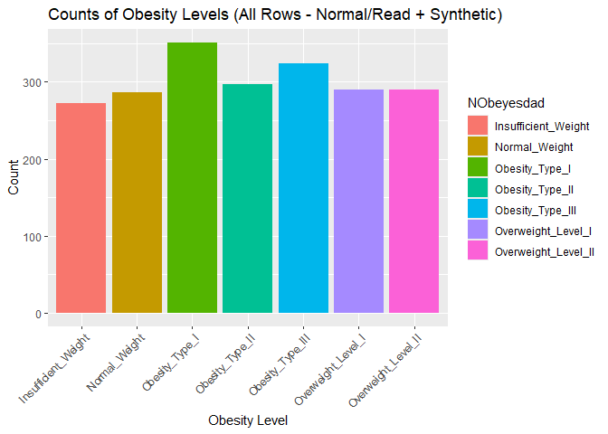<!-- -->

``` r
#"Normal Weight" is as balanced as the other classes when we consider all NObeyesdad values
```

## Cleaning Data: Rounding

``` r
#Because syn_df does not contain "Normal Weight", we will not use it for model training. We will instead compare model training results with normal_df (contains only real data) and df (contains BOTH real and synthetic data)

# Rounding Logic for both normal_df and df:
str(df)
```

    ## 'data.frame':    2111 obs. of  17 variables:
    ##  $ Gender                        : chr  "Female" "Female" "Male" "Male" ...
    ##  $ Age                           : num  21 21 23 27 22 29 23 22 24 22 ...
    ##  $ Height                        : num  1.62 1.52 1.8 1.8 1.78 1.62 1.5 1.64 1.78 1.72 ...
    ##  $ Weight                        : num  64 56 77 87 89.8 53 55 53 64 68 ...
    ##  $ family_history_with_overweight: chr  "yes" "yes" "yes" "no" ...
    ##  $ FAVC                          : chr  "no" "no" "no" "no" ...
    ##  $ FCVC                          : num  2 3 2 3 2 2 3 2 3 2 ...
    ##  $ NCP                           : num  3 3 3 3 1 3 3 3 3 3 ...
    ##  $ CAEC                          : chr  "Sometimes" "Sometimes" "Sometimes" "Sometimes" ...
    ##  $ SMOKE                         : chr  "no" "yes" "no" "no" ...
    ##  $ CH2O                          : num  2 3 2 2 2 2 2 2 2 2 ...
    ##  $ SCC                           : chr  "no" "yes" "no" "no" ...
    ##  $ FAF                           : num  0 3 2 2 0 0 1 3 1 1 ...
    ##  $ TUE                           : num  1 0 1 0 0 0 0 0 1 1 ...
    ##  $ CALC                          : chr  "no" "Sometimes" "Frequently" "Frequently" ...
    ##  $ MTRANS                        : chr  "Public_Transportation" "Public_Transportation" "Public_Transportation" "Walking" ...
    ##  $ NObeyesdad                    : chr  "Normal_Weight" "Normal_Weight" "Normal_Weight" "Overweight_Level_I" ...

``` r
#   Age     0 decimals, age in years, whole number only
#   Height  2 decimals height in meters, 2 decimal points for cm precision
#   Weight  1 decimal weight in kg, 1 decimal point is sufficient
#   FCVC    0 decimals scale 1-3, whole number only (categorical) - recoded to 0/1/2 for consistency
#   NCP     0 decimals number of meals, whole number only
#   CH2O    0 decimal water intake scale 1-3, whole number only (in liters) - recoded to 0/1/2 for consistency
#   FAF     0 decimal physical activity scale 0-3 (in days)
#   TUE     0 decimals tech use scale 0-2, whole number only

#Rounding code:
round_df <- function(df){
  df$Age    <- round(df$Age,    0)
  df$Height <- round(df$Height, 2)
  df$Weight <- round(df$Weight, 1)
  df$FCVC   <- as.numeric(round(df$FCVC, 0))
  #Recode FCVC to 0/1/2
  df$FCVC <- df$FCVC - 1
  df$NCP    <- as.numeric(round(df$NCP,  0))
  df$CH2O   <- round(df$CH2O, 0)
  #Recode CH2O to 0/1/2
  df$CH2O <- df$CH2O - 1
  df$FAF    <- round(df$FAF,  0)
  df$TUE    <- as.numeric(round(df$TUE,  0))
  
  return(df)
}

normal_df <- round_df(normal_df)
df <- round_df(df)

#Convert NObeyesdad to factors
normal_df$NObeyesdad <- as.factor(normal_df$NObeyesdad)
df$NObeyesdad <- as.factor(df$NObeyesdad)
```

# **Modeling**

## Splitting Data

``` r
# Set seed for reproducibility 
set.seed(73)

# Split data
normal_df_split <- initial_split(normal_df, strata = NObeyesdad)
syn_df_split <- initial_split(df, strata = NObeyesdad)

normal_obesity_train <- training(normal_df_split)
normal_obesity_test <- testing(normal_df_split)

syn_obesity_train <- training(syn_df_split)
syn_obesity_test <- testing(syn_df_split)

# Preparing folds for cross validation and resampling
normal_tree_folds <- vfold_cv(normal_obesity_train, v = 10,
                       strata = NObeyesdad)
syn_tree_folds <- vfold_cv(syn_obesity_train, v = 10,
                           strata = NObeyesdad)
    
# Creating custom metrics
tree_metrics <- metric_set(accuracy, roc_auc, sens, spec)
```

# Model 1 - Base Decision Tree: Real Data (normal_df)

``` r
### REAL DATA (normal_df) ###

# Specify Model
base_tree_model <- decision_tree() %>% 
  set_engine('rpart') %>% 
  set_mode('classification')

# Create Recipe
tree_recipe <- recipe(NObeyesdad ~ ., data = normal_obesity_train) %>%
  step_novel(all_nominal_predictors(), new_level = "other") %>% 
  step_dummy(all_nominal_predictors())

# Create Workflow
tree_workflow <- workflow() %>% 
  add_model(base_tree_model) %>% 
  add_recipe(tree_recipe)

# Fit resamples (CV)
tree_fit_resample <- tree_workflow %>%
  fit_resamples(resamples = normal_tree_folds,
                metrics = tree_metrics)
```

    ## Warning: package 'future' was built under R version 4.5.3

    ## Warning: package 'tune' was built under R version 4.5.3

    ## → A | warning: While computing multiclass `sens()`, some levels had no true events (i.e.
    ##                `true_positive + false_negative = 0`).
    ##                Sensitivity is undefined in this case, and those levels will be removed from
    ##                the averaged result.
    ##                Note that the following number of predicted events actually occurred for each
    ##                problematic event level:
    ##                'Obesity_Type_II': 0, 'Obesity_Type_III': 0

    ## → B | warning: ✖ No observations were detected in `truth` for levels: Obesity_Type_II and
    ##                  Obesity_Type_III.
    ##                ℹ Computation will proceed by ignoring those levels.

    ## Warning: package 'future' was built under R version 4.5.3
    ## Warning: package 'tune' was built under R version 4.5.3

    ## → A | warning: While computing multiclass `sens()`, some levels had no true events (i.e.
    ##                `true_positive + false_negative = 0`).
    ##                Sensitivity is undefined in this case, and those levels will be removed from
    ##                the averaged result.
    ##                Note that the following number of predicted events actually occurred for each
    ##                problematic event level:
    ##                'Obesity_Type_III': 0

    ## → B | warning: ✖ No observations were detected in `truth` for level: Obesity_Type_III.
    ##                ℹ Computation will proceed by ignoring those levels.

    ## Warning: package 'future' was built under R version 4.5.3
    ## Warning: package 'tune' was built under R version 4.5.3

    ## Warning: package 'future' was built under R version 4.5.3

    ## Warning: package 'tune' was built under R version 4.5.3

    ## → A | warning: While computing multiclass `sens()`, some levels had no true events (i.e.
    ##                `true_positive + false_negative = 0`).
    ##                Sensitivity is undefined in this case, and those levels will be removed from
    ##                the averaged result.
    ##                Note that the following number of predicted events actually occurred for each
    ##                problematic event level:
    ##                'Obesity_Type_III': 0
    ## → B | warning: ✖ No observations were detected in `truth` for level: Obesity_Type_III.
    ##                ℹ Computation will proceed by ignoring those levels.

    ## Warning: package 'future' was built under R version 4.5.3
    ## Warning: package 'tune' was built under R version 4.5.3

    ## → A | warning: While computing multiclass `sens()`, some levels had no true events (i.e.
    ##                `true_positive + false_negative = 0`).
    ##                Sensitivity is undefined in this case, and those levels will be removed from
    ##                the averaged result.
    ##                Note that the following number of predicted events actually occurred for each
    ##                problematic event level:
    ##                'Obesity_Type_II': 0, 'Obesity_Type_III': 0

    ## → B | warning: ✖ No observations were detected in `truth` for levels: Obesity_Type_II and
    ##                  Obesity_Type_III.
    ##                ℹ Computation will proceed by ignoring those levels.

    ## Warning: package 'future' was built under R version 4.5.3
    ## Warning: package 'tune' was built under R version 4.5.3

    ## → A | warning: While computing multiclass `sens()`, some levels had no true events (i.e.
    ##                `true_positive + false_negative = 0`).
    ##                Sensitivity is undefined in this case, and those levels will be removed from
    ##                the averaged result.
    ##                Note that the following number of predicted events actually occurred for each
    ##                problematic event level:
    ##                'Insufficient_Weight': 1, 'Obesity_Type_II': 2

    ## → B | warning: ✖ No observations were detected in `truth` for levels: Insufficient_Weight and
    ##                  Obesity_Type_II.
    ##                ℹ Computation will proceed by ignoring those levels.

    ## Warning: package 'future' was built under R version 4.5.3
    ## Warning: package 'tune' was built under R version 4.5.3

    ## → A | warning: While computing multiclass `sens()`, some levels had no true events (i.e.
    ##                `true_positive + false_negative = 0`).
    ##                Sensitivity is undefined in this case, and those levels will be removed from
    ##                the averaged result.
    ##                Note that the following number of predicted events actually occurred for each
    ##                problematic event level:
    ##                'Obesity_Type_II': 1, 'Obesity_Type_III': 0

    ## → B | warning: ✖ No observations were detected in `truth` for levels: Obesity_Type_II and
    ##                  Obesity_Type_III.
    ##                ℹ Computation will proceed by ignoring those levels.

    ## Warning: package 'future' was built under R version 4.5.3
    ## Warning: package 'tune' was built under R version 4.5.3

    ## → A | warning: While computing multiclass `sens()`, some levels had no true events (i.e.
    ##                `true_positive + false_negative = 0`).
    ##                Sensitivity is undefined in this case, and those levels will be removed from
    ##                the averaged result.
    ##                Note that the following number of predicted events actually occurred for each
    ##                problematic event level:
    ##                'Obesity_Type_III': 0

    ## → B | warning: ✖ No observations were detected in `truth` for level: Obesity_Type_III.
    ##                ℹ Computation will proceed by ignoring those levels.

    ## Warning: package 'future' was built under R version 4.5.3
    ## Warning: package 'tune' was built under R version 4.5.3

    ## → A | warning: While computing multiclass `sens()`, some levels had no true events (i.e.
    ##                `true_positive + false_negative = 0`).
    ##                Sensitivity is undefined in this case, and those levels will be removed from
    ##                the averaged result.
    ##                Note that the following number of predicted events actually occurred for each
    ##                problematic event level:
    ##                'Obesity_Type_II': 1, 'Obesity_Type_III': 0

    ## → B | warning: ✖ No observations were detected in `truth` for levels: Obesity_Type_II and
    ##                  Obesity_Type_III.
    ##                ℹ Computation will proceed by ignoring those levels.

    ## Warning: package 'future' was built under R version 4.5.3
    ## Warning: package 'tune' was built under R version 4.5.3

``` r
tree_fit_rs_result <- tree_fit_resample %>% 
  collect_metrics(summarize = F)

tree_fit_rs_result %>%
  filter(.metric == 'roc_auc') %>% 
  group_by(id) %>%
  summarize(min_roc_auc = min(.estimate),
            median_roc_auc = median(.estimate),
            max_roc_auc = max(.estimate))
```

    ## # A tibble: 10 × 4
    ##    id     min_roc_auc median_roc_auc max_roc_auc
    ##    <chr>        <dbl>          <dbl>       <dbl>
    ##  1 Fold01       0.951          0.951       0.951
    ##  2 Fold02       0.870          0.870       0.870
    ##  3 Fold03       0.782          0.782       0.782
    ##  4 Fold04       0.860          0.860       0.860
    ##  5 Fold05       0.953          0.953       0.953
    ##  6 Fold06       0.891          0.891       0.891
    ##  7 Fold07       0.956          0.956       0.956
    ##  8 Fold08       0.794          0.794       0.794
    ##  9 Fold09       0.884          0.884       0.884
    ## 10 Fold10       0.908          0.908       0.908

``` r
tree_fit_rs_result %>%
  group_by(.metric) %>%
  summarize(min = min(.estimate),
            median = median(.estimate),
            max = max(.estimate))
```

    ## # A tibble: 4 × 4
    ##   .metric    min median   max
    ##   <chr>    <dbl>  <dbl> <dbl>
    ## 1 accuracy 0.605  0.743 0.8  
    ## 2 roc_auc  0.782  0.888 0.956
    ## 3 sens     0.409  0.570 0.776
    ## 4 spec     0.912  0.946 0.960

``` r
# 10 fold estimates (CV results)
#   .metric       min         median        max
#   accuracy      0.6052632   0.7434211   0.8000000 
#   roc_auc     0.7821145     0.8875162   0.9562112 
#   sens          0.4085859   0.5702521   0.7759420 
#   spec          0.9119484   0.9459625   0.9598066

# obtain mean roc_auc score
tree_fit_rs_result %>%
  filter(.metric == "roc_auc") %>%
  group_by(.metric) %>%
  summarize(mean = mean(.estimate))
```

    ## # A tibble: 1 × 2
    ##   .metric  mean
    ##   <chr>   <dbl>
    ## 1 roc_auc 0.885

``` r
# .metric     .mean
#   roc_auc 0.8848726

# Fit & Test
base_tree_fit <- tree_workflow %>% 
  last_fit(split = normal_df_split, metrics = tree_metrics)
```

    ## → A | warning: While computing multiclass `sens()`, some levels had no true events (i.e.
    ##                `true_positive + false_negative = 0`).
    ##                Sensitivity is undefined in this case, and those levels will be removed from
    ##                the averaged result.
    ##                Note that the following number of predicted events actually occurred for each
    ##                problematic event level:
    ##                'Obesity_Type_III': 0

    ## → B | warning: ✖ No observations were detected in `truth` for level: Obesity_Type_III.
    ##                ℹ Computation will proceed by ignoring those levels.

    ## There were issues with some computations   A: x1   B: x1There were issues with some computations   A: x1   B: x1

``` r
# Collect Metrics    
base_tree_fit %>% 
  collect_metrics()
```

    ## # A tibble: 4 × 4
    ##   .metric  .estimator .estimate .config        
    ##   <chr>    <chr>          <dbl> <chr>          
    ## 1 accuracy multiclass     0.798 pre0_mod0_post0
    ## 2 sens     macro          0.682 pre0_mod0_post0
    ## 3 spec     macro          0.956 pre0_mod0_post0
    ## 4 roc_auc  hand_till      0.939 pre0_mod0_post0

``` r
# Base decision tree model results
# accuracy  multiclass  0.7984496
# sens      macro         0.6822979 
# spec      macro         0.9561176 
# roc_auc     hand_till   0.9388945 
```

# Model 1 - Base Decision Tree: Synthetic data (df)

``` r
tree_recipe <- recipe(NObeyesdad ~ ., data = syn_obesity_train) %>%
  step_novel(all_nominal_predictors(), new_level = "other") %>% 
  step_dummy(all_nominal_predictors())

# Create Workflow
tree_workflow <- workflow() %>% 
  add_model(base_tree_model) %>% 
  add_recipe(tree_recipe)

# Fit resamples (CV)
tree_fit_resample <- tree_workflow %>%
  fit_resamples(resamples = syn_tree_folds,
                metrics = tree_metrics)
    
tree_fit_rs_result <- tree_fit_resample %>% 
  collect_metrics(summarize = F)

tree_fit_rs_result %>%
  filter(.metric == 'roc_auc') %>% 
  group_by(id) %>%
  summarize(min_roc_auc = min(.estimate),
            median_roc_auc = median(.estimate),
            max_roc_auc = max(.estimate))
```

    ## # A tibble: 10 × 4
    ##    id     min_roc_auc median_roc_auc max_roc_auc
    ##    <chr>        <dbl>          <dbl>       <dbl>
    ##  1 Fold01       0.969          0.969       0.969
    ##  2 Fold02       0.970          0.970       0.970
    ##  3 Fold03       0.977          0.977       0.977
    ##  4 Fold04       0.976          0.976       0.976
    ##  5 Fold05       0.966          0.966       0.966
    ##  6 Fold06       0.975          0.975       0.975
    ##  7 Fold07       0.976          0.976       0.976
    ##  8 Fold08       0.986          0.986       0.986
    ##  9 Fold09       0.983          0.983       0.983
    ## 10 Fold10       0.980          0.980       0.980

``` r
tree_fit_rs_result %>%
  group_by(.metric) %>%
  summarize(min = min(.estimate),
            median = median(.estimate),
            max = max(.estimate))
```

    ## # A tibble: 4 × 4
    ##   .metric    min median   max
    ##   <chr>    <dbl>  <dbl> <dbl>
    ## 1 accuracy 0.846  0.885 0.910
    ## 2 roc_auc  0.966  0.976 0.986
    ## 3 sens     0.844  0.878 0.909
    ## 4 spec     0.974  0.981 0.985

``` r
# 10 fold estimates (CV results)
#   .metric       min         median        max
#   accuracy      0.8456790   0.8846106   0.9096774 
#   roc_auc     0.9655698     0.9761792   0.9860841 
#   sens          0.8438571   0.8783675   0.9086866 
#   spec          0.9742624   0.9808544   0.9850412 

# obtain mean roc_auc score
tree_fit_rs_result %>%
  filter(.metric == "roc_auc") %>%
  group_by(.metric) %>%
  summarize(mean = mean(.estimate))
```

    ## # A tibble: 1 × 2
    ##   .metric  mean
    ##   <chr>   <dbl>
    ## 1 roc_auc 0.976

``` r
# .metric     .mean
#   roc_auc   0.97596   

# Fit & Test
base_tree_fit <- tree_workflow %>% 
  last_fit(split = syn_df_split, metrics = tree_metrics)

# Collect Metrics    
base_tree_fit %>% 
  collect_metrics()
```

    ## # A tibble: 4 × 4
    ##   .metric  .estimator .estimate .config        
    ##   <chr>    <chr>          <dbl> <chr>          
    ## 1 accuracy multiclass     0.885 pre0_mod0_post0
    ## 2 sens     macro          0.881 pre0_mod0_post0
    ## 3 spec     macro          0.981 pre0_mod0_post0
    ## 4 roc_auc  hand_till      0.978 pre0_mod0_post0

``` r
# Base decision tree model results
# accuracy  multiclass  0.8849057   
# sens      macro         0.8809348 
# spec      macro         0.9808438     
# roc_auc     hand_till   0.9776858 
```

# Model 2 - Base Decision Tree Model w/ Tuned Hyper-Parameters: Real Data (normal_df)

``` r
# Specify Model
tune_tree_model <- decision_tree(
  cost_complexity = tune(),
  tree_depth = tune(),
  min_n = tune()
  ) %>% 
  set_engine('rpart') %>% 
  set_mode('classification')

# Create tuning grid for hyper-parameters
tree_grid <- grid_random(extract_parameter_set_dials(tune_tree_model), size = 20)

# Update workflow object with new model: tune_tree_model
tree_workflow <- tree_workflow %>%
  update_model(tune_tree_model)

# Tuning and resampling (cv)
tuning_tree_results <- tree_workflow %>% 
  tune_grid(resamples = normal_tree_folds,
            grid = tree_grid,
            metrics = tree_metrics)
```

    ## → C | warning: While computing multiclass `sens()`, some levels had no true events (i.e.
    ##                `true_positive + false_negative = 0`).
    ##                Sensitivity is undefined in this case, and those levels will be removed from
    ##                the averaged result.
    ##                Note that the following number of predicted events actually occurred for each
    ##                problematic event level:
    ##                'Obesity_Type_II': 1, 'Obesity_Type_III': 0

    ## → C | warning: While computing multiclass `sens()`, some levels had no true events (i.e.
    ##                `true_positive + false_negative = 0`).
    ##                Sensitivity is undefined in this case, and those levels will be removed from
    ##                the averaged result.
    ##                Note that the following number of predicted events actually occurred for each
    ##                problematic event level:
    ##                'Insufficient_Weight': 0, 'Obesity_Type_II': 0

    ## → D | warning: While computing multiclass `sens()`, some levels had no true events (i.e.
    ##                `true_positive + false_negative = 0`).
    ##                Sensitivity is undefined in this case, and those levels will be removed from
    ##                the averaged result.
    ##                Note that the following number of predicted events actually occurred for each
    ##                problematic event level:
    ##                'Insufficient_Weight': 1, 'Obesity_Type_II': 0

    ## → E | warning: While computing multiclass `sens()`, some levels had no true events (i.e.
    ##                `true_positive + false_negative = 0`).
    ##                Sensitivity is undefined in this case, and those levels will be removed from
    ##                the averaged result.
    ##                Note that the following number of predicted events actually occurred for each
    ##                problematic event level:
    ##                'Insufficient_Weight': 0, 'Obesity_Type_II': 2

    ## → F | warning: While computing multiclass `sens()`, some levels had no true events (i.e.
    ##                `true_positive + false_negative = 0`).
    ##                Sensitivity is undefined in this case, and those levels will be removed from
    ##                the averaged result.
    ##                Note that the following number of predicted events actually occurred for each
    ##                problematic event level:
    ##                'Insufficient_Weight': 1, 'Obesity_Type_II': 1

    ## → C | warning: While computing multiclass `sens()`, some levels had no true events (i.e.
    ##                `true_positive + false_negative = 0`).
    ##                Sensitivity is undefined in this case, and those levels will be removed from
    ##                the averaged result.
    ##                Note that the following number of predicted events actually occurred for each
    ##                problematic event level:
    ##                'Obesity_Type_II': 0, 'Obesity_Type_III': 0

    ## → C | warning: While computing multiclass `sens()`, some levels had no true events (i.e.
    ##                `true_positive + false_negative = 0`).
    ##                Sensitivity is undefined in this case, and those levels will be removed from
    ##                the averaged result.
    ##                Note that the following number of predicted events actually occurred for each
    ##                problematic event level:
    ##                'Obesity_Type_III': 1

    ## → C | warning: While computing multiclass `sens()`, some levels had no true events (i.e.
    ##                `true_positive + false_negative = 0`).
    ##                Sensitivity is undefined in this case, and those levels will be removed from
    ##                the averaged result.
    ##                Note that the following number of predicted events actually occurred for each
    ##                problematic event level:
    ##                'Obesity_Type_II': 0, 'Obesity_Type_III': 0

``` r
tuning_tree_results %>% 
  collect_metrics(summarize = FALSE) %>% 
  filter(.metric == "roc_auc") %>% 
  group_by(id) %>% 
  summarize(min_roc_auc = min(.estimate),
            median_roc_auc = median(.estimate),
            max_roc_auc = max(.estimate))
```

    ## # A tibble: 10 × 4
    ##    id     min_roc_auc median_roc_auc max_roc_auc
    ##    <chr>        <dbl>          <dbl>       <dbl>
    ##  1 Fold01       0.704          0.886       0.990
    ##  2 Fold02       0.7            0.909       0.939
    ##  3 Fold03       0.690          0.773       0.810
    ##  4 Fold04       0.682          0.845       0.897
    ##  5 Fold05       0.703          0.949       0.978
    ##  6 Fold06       0.640          0.853       0.891
    ##  7 Fold07       0.730          0.920       0.973
    ##  8 Fold08       0.680          0.824       0.865
    ##  9 Fold09       0.672          0.852       0.937
    ## 10 Fold10       0.683          0.878       0.925

``` r
autoplot(tuning_tree_results)
```

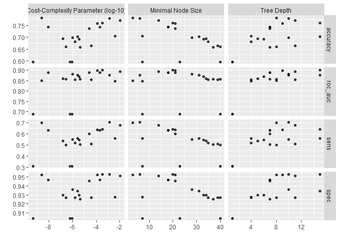<!-- -->

``` r
tuning_tree_results %>% 
  show_best(metric = 'roc_auc', n = 5)
```

    ## # A tibble: 5 × 9
    ##   cost_complexity tree_depth min_n .metric .estimator  mean     n std_err
    ##             <dbl>      <int> <int> <chr>   <chr>      <dbl> <int>   <dbl>
    ## 1   0.000324              15    20 roc_auc hand_till  0.902    10  0.0173
    ## 2   0.000126               9    21 roc_auc hand_till  0.900    10  0.0168
    ## 3   0.0110                11    14 roc_auc hand_till  0.895    10  0.0218
    ## 4   0.00000000859          7    18 roc_auc hand_till  0.890    10  0.0204
    ## 5   0.000202               7    18 roc_auc hand_till  0.890    10  0.0204
    ## # ℹ 1 more variable: .config <chr>

``` r
# Top 5:
# cost_complexity     tree_depth    min_n   .metric   .estimator    mean          n     std_err
# 3.243197e-04        15              20        roc_auc   hand_till     0.9016376       10    0.01725857
# 1.258728e-04        9             21      roc_auc   hand_till     0.8996373       10    0.01683664
# 1.102454e-02        11              14        roc_auc   hand_till     0.8945377       10    0.02182977
# 8.593975e-09        7             18      roc_auc   hand_till     0.8898451       10    0.02039882
# 2.018634e-04        7             18      roc_auc   hand_till     0.8898451       10    0.02039882    

# obtain mean roc_auc score
tuning_tree_results %>%
  show_best(metric = "roc_auc") %>%
  group_by(.metric) %>%
  summarize(mean = mean(mean))
```

    ## # A tibble: 1 × 2
    ##   .metric  mean
    ##   <chr>   <dbl>
    ## 1 roc_auc 0.895

``` r
# .metric   .mean
# roc_auc  0.8951006        

best_tune_tree_model <- tuning_tree_results %>% 
  select_best(metric = 'roc_auc')

final_tune_tree_workflow <- tree_workflow %>% 
  finalize_workflow(best_tune_tree_model)

final_tune_tree_fit <- final_tune_tree_workflow %>% 
  last_fit(split = normal_df_split, metrics = tree_metrics)
```

    ## → A | warning: While computing multiclass `sens()`, some levels had no true events (i.e.
    ##                `true_positive + false_negative = 0`).
    ##                Sensitivity is undefined in this case, and those levels will be removed from
    ##                the averaged result.
    ##                Note that the following number of predicted events actually occurred for each
    ##                problematic event level:
    ##                'Obesity_Type_III': 0

    ## → B | warning: ✖ No observations were detected in `truth` for level: Obesity_Type_III.
    ##                ℹ Computation will proceed by ignoring those levels.

    ## There were issues with some computations   A: x1   B: x1There were issues with some computations   A: x1   B: x1

``` r
final_tune_tree_fit %>% 
  collect_metrics()
```

    ## # A tibble: 4 × 4
    ##   .metric  .estimator .estimate .config        
    ##   <chr>    <chr>          <dbl> <chr>          
    ## 1 accuracy multiclass     0.798 pre0_mod0_post0
    ## 2 sens     macro          0.738 pre0_mod0_post0
    ## 3 spec     macro          0.960 pre0_mod0_post0
    ## 4 roc_auc  hand_till      0.938 pre0_mod0_post0

``` r
# Tuned Decision Tree Model Results
# accuracy multiclass     0.7984496 
# sens     macro          0.7379486 
# spec     macro          0.9602287
# roc_auc  hand_till      0.9381596 
```

# Model 2 - Base Decision Tree Model w/ Tuned Hyper-Parameters: Synthetic Data (df)

``` r
# Specify Model
tune_tree_model <- decision_tree(
  cost_complexity = tune(),
  tree_depth = tune(),
  min_n = tune()
  ) %>% 
  set_engine('rpart') %>% 
  set_mode('classification')

# Create tuning grid for hyper-parameters
tree_grid <- grid_random(extract_parameter_set_dials(tune_tree_model), size = 20)

# Update workflow object with new model: tune_tree_model
tree_workflow <- tree_workflow %>%
  update_model(tune_tree_model)

# Tuning and resampling (cv)
tuning_tree_results <- tree_workflow %>% 
  tune_grid(resamples = syn_tree_folds,
            grid = tree_grid,
            metrics = tree_metrics)

tuning_tree_results %>% 
  collect_metrics(summarize = FALSE) %>% 
  filter(.metric == "roc_auc") %>% 
  group_by(id) %>% 
  summarize(min_roc_auc = min(.estimate),
            median_roc_auc = median(.estimate),
            max_roc_auc = max(.estimate))
```

    ## # A tibble: 10 × 4
    ##    id     min_roc_auc median_roc_auc max_roc_auc
    ##    <chr>        <dbl>          <dbl>       <dbl>
    ##  1 Fold01       0.721          0.946       0.975
    ##  2 Fold02       0.719          0.953       0.983
    ##  3 Fold03       0.724          0.961       0.985
    ##  4 Fold04       0.718          0.959       0.990
    ##  5 Fold05       0.722          0.960       0.982
    ##  6 Fold06       0.722          0.962       0.987
    ##  7 Fold07       0.714          0.955       0.983
    ##  8 Fold08       0.725          0.972       0.988
    ##  9 Fold09       0.720          0.963       0.992
    ## 10 Fold10       0.716          0.955       0.988

``` r
autoplot(tuning_tree_results)
```

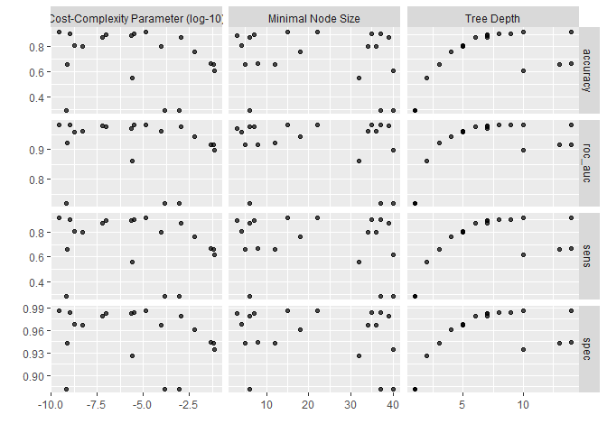<!-- -->

``` r
tuning_tree_results %>% 
  show_best(metric = 'roc_auc', n = 5)
```

    ## # A tibble: 5 × 9
    ##   cost_complexity tree_depth min_n .metric .estimator  mean     n std_err
    ##             <dbl>      <int> <int> <chr>   <chr>      <dbl> <int>   <dbl>
    ## 1        1.36e- 5         14    22 roc_auc hand_till  0.983    10 0.00229
    ## 2        2.54e-10         10    15 roc_auc hand_till  0.982    10 0.00235
    ## 3        2.99e- 6          9    35 roc_auc hand_till  0.982    10 0.00190
    ## 4        9.72e-10          8    37 roc_auc hand_till  0.982    10 0.00190
    ## 5        5.64e- 8          7    39 roc_auc hand_till  0.980    10 0.00193
    ## # ℹ 1 more variable: .config <chr>

``` r
# Top 5:
# cost_complexity     tree_depth    min_n   .metric   .estimator    mean          n     std_err
# 1.360564e-05        14              22        roc_auc   hand_till     0.9825882       10    0.002290333   
# 2.537619e-10        10              15        roc_auc   hand_till     0.9823914       10    0.002352027   
# 2.994957e-06        9             35      roc_auc   hand_till     0.9819036       10    0.001896366   
# 9.723147e-10        8             37      roc_auc   hand_till     0.9818976       10    0.001896149
# 5.640532e-08        7             39      roc_auc   hand_till     0.9803524       10    0.001934734

# obtain mean roc_auc score
tuning_tree_results %>%
  show_best(metric = "roc_auc") %>%
  group_by(.metric) %>%
  summarize(mean = mean(mean))
```

    ## # A tibble: 1 × 2
    ##   .metric  mean
    ##   <chr>   <dbl>
    ## 1 roc_auc 0.982

``` r
# .metric   .mean
# roc_auc  0.9818266    

best_tune_tree_model <- tuning_tree_results %>% 
  select_best(metric = 'roc_auc')

final_tune_tree_workflow <- tree_workflow %>% 
  finalize_workflow(best_tune_tree_model)

final_tune_tree_fit <- final_tune_tree_workflow %>% 
  last_fit(split = syn_df_split, metrics = tree_metrics)

final_tune_tree_fit %>% 
  collect_metrics()
```

    ## # A tibble: 4 × 4
    ##   .metric  .estimator .estimate .config        
    ##   <chr>    <chr>          <dbl> <chr>          
    ## 1 accuracy multiclass     0.943 pre0_mod0_post0
    ## 2 sens     macro          0.942 pre0_mod0_post0
    ## 3 spec     macro          0.991 pre0_mod0_post0
    ## 4 roc_auc  hand_till      0.989 pre0_mod0_post0

``` r
# Tuned Decision Tree Model Results
# accuracy multiclass     0.9433962 
# sens     macro          0.9424962 
# spec     macro          0.9905704
# roc_auc  hand_till      0.9888267 
```

# Model 3.1 - Gradient Boosted Tree Model: Real Data (normal_df)

``` r
# Specify Model
gradient_boost_tree_model <- boost_tree() %>% 
  set_mode("classification") %>% 
  set_engine("xgboost")

# Create Recipe
boost_recipe <- recipe(NObeyesdad ~ ., data = normal_obesity_train) %>%
  step_novel(all_nominal_predictors(), new_level = "other") %>% 
  step_dummy(all_nominal_predictors())

# Create Workflow
boost_workflow <- workflow() %>% 
  add_recipe(boost_recipe) %>% 
  add_model(gradient_boost_tree_model)

# Last fit - train and test
boosted_fit <- boost_workflow %>%
 last_fit(NObeyesdad ~ ., split = normal_df_split, metrics = tree_metrics)
```

    ## Warning: The `...` are not used in this function but 1 unnamed object was
    ## passed.

    ## → A | warning: While computing multiclass `sens()`, some levels had no true events (i.e.
    ##                `true_positive + false_negative = 0`).
    ##                Sensitivity is undefined in this case, and those levels will be removed from
    ##                the averaged result.
    ##                Note that the following number of predicted events actually occurred for each
    ##                problematic event level:
    ##                'Obesity_Type_III': 0

    ## → B | warning: ✖ No observations were detected in `truth` for level: Obesity_Type_III.
    ##                ℹ Computation will proceed by ignoring those levels.

    ## There were issues with some computations   A: x1   B: x1There were issues with some computations   A: x1   B: x1

``` r
boosted_fit %>% 
  collect_metrics()
```

    ## # A tibble: 4 × 4
    ##   .metric  .estimator .estimate .config        
    ##   <chr>    <chr>          <dbl> <chr>          
    ## 1 accuracy multiclass     0.837 pre0_mod0_post0
    ## 2 sens     macro          0.681 pre0_mod0_post0
    ## 3 spec     macro          0.960 pre0_mod0_post0
    ## 4 roc_auc  hand_till      0.940 pre0_mod0_post0

``` r
# Base gradient boosted tree model results
  # accuracy multiclass     0.8372093 
  # sens     macro          0.6813674 
  # spec     macro          0.9597362
  # roc_auc  hand_till      0.9397156 

# Collect predictions
boosted_predictions <- boosted_fit %>% 
  collect_predictions()

boosted_predictions
```

    ## # A tibble: 129 × 12
    ##    .pred_class   .pred_Insufficient_W…¹ .pred_Normal_Weight .pred_Obesity_Type_I
    ##    <fct>                          <dbl>               <dbl>                <dbl>
    ##  1 Normal_Weight                0.00847              0.564               0.0183 
    ##  2 Normal_Weight                0.00859              0.973               0.00406
    ##  3 Obesity_Type…                0.0171               0.0749              0.523  
    ##  4 Obesity_Type…                0.00727              0.0774              0.711  
    ##  5 Normal_Weight                0.0160               0.817               0.0177 
    ##  6 Normal_Weight                0.00579              0.957               0.00638
    ##  7 Overweight_L…                0.00556              0.0592              0.0199 
    ##  8 Normal_Weight                0.00775              0.961               0.00579
    ##  9 Normal_Weight                0.0356               0.931               0.00761
    ## 10 Normal_Weight                0.00341              0.978               0.00323
    ## # ℹ 119 more rows
    ## # ℹ abbreviated name: ¹​.pred_Insufficient_Weight
    ## # ℹ 8 more variables: .pred_Obesity_Type_II <dbl>,
    ## #   .pred_Obesity_Type_III <dbl>, .pred_Overweight_Level_I <dbl>,
    ## #   .pred_Overweight_Level_II <dbl>, id <chr>, NObeyesdad <fct>, .row <int>,
    ## #   .config <chr>

``` r
boosted_predictions <- boosted_predictions %>%
  mutate(NObeyesdad = fct_drop(NObeyesdad))

# Visualize ROC curve
boosted_roc <- boosted_predictions %>% 
  roc_curve(truth = NObeyesdad, .pred_Insufficient_Weight:.pred_Overweight_Level_II,
            -.pred_Obesity_Type_III, #drop obesity type III since none exist in the test set
        estimator = "macro")

ggplot(boosted_roc, aes(x = 1 - specificity, y = sensitivity, color = .level)) +
  geom_line(linewidth = .75, alpha = .75) +
  labs(color = "Obesity Level") +
  geom_abline(lty = 2, alpha = .5) +
  theme_light() +
  labs(title = "ROC Curve 3: Gradient Boosted Tree Model (Real Data)")
```

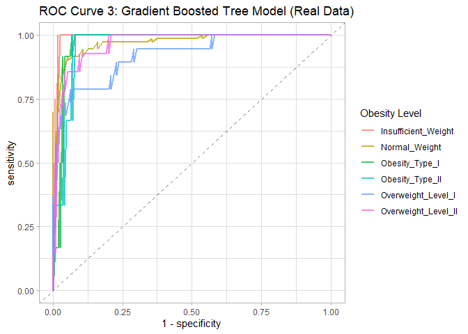<!-- --> \# Model 3.1 -
Gradient Boosted Tree Model: Synthetic Data (df)

``` r
# Specify Model
gradient_boost_tree_model <- boost_tree() %>% 
  set_mode("classification") %>% 
  set_engine("xgboost")

# Create Recipe
boost_recipe <- recipe(NObeyesdad ~ ., data = syn_obesity_train) %>%
  step_novel(all_nominal_predictors(), new_level = "other") %>% 
  step_dummy(all_nominal_predictors())

# Create Workflow
boost_workflow <- workflow() %>% 
  add_recipe(boost_recipe) %>% 
  add_model(gradient_boost_tree_model)

# Last fit - train and test
boosted_fit <- boost_workflow %>%
 last_fit(NObeyesdad ~ ., split = syn_df_split, metrics = tree_metrics)
```

    ## Warning: The `...` are not used in this function but 1 unnamed object was
    ## passed.

``` r
boosted_fit %>% 
  collect_metrics()
```

    ## # A tibble: 4 × 4
    ##   .metric  .estimator .estimate .config        
    ##   <chr>    <chr>          <dbl> <chr>          
    ## 1 accuracy multiclass     0.972 pre0_mod0_post0
    ## 2 sens     macro          0.970 pre0_mod0_post0
    ## 3 spec     macro          0.995 pre0_mod0_post0
    ## 4 roc_auc  hand_till      0.998 pre0_mod0_post0

``` r
# Base gradient boosted tree model results
  # accuracy multiclass     0.9716981 
  # sens     macro          0.9702199 
  # spec     macro          0.9952840
  # roc_auc  hand_till      0.9977706 

# Collect predictions
boosted_predictions <- boosted_fit %>% 
  collect_predictions()

boosted_predictions
```

    ## # A tibble: 530 × 12
    ##    .pred_class   .pred_Insufficient_W…¹ .pred_Normal_Weight .pred_Obesity_Type_I
    ##    <fct>                          <dbl>               <dbl>                <dbl>
    ##  1 Normal_Weight                0.0181              0.514                0.0194 
    ##  2 Overweight_L…                0.0139              0.358                0.0128 
    ##  3 Normal_Weight                0.00536             0.714                0.00627
    ##  4 Obesity_Type…                0.00800             0.00890              0.776  
    ##  5 Obesity_Type…                0.00209             0.00294              0.969  
    ##  6 Overweight_L…                0.0168              0.0307               0.0383 
    ##  7 Overweight_L…                0.0123              0.112                0.0158 
    ##  8 Normal_Weight                0.00690             0.948                0.00890
    ##  9 Normal_Weight                0.00365             0.664                0.00470
    ## 10 Overweight_L…                0.00931             0.0525               0.0151 
    ## # ℹ 520 more rows
    ## # ℹ abbreviated name: ¹​.pred_Insufficient_Weight
    ## # ℹ 8 more variables: .pred_Obesity_Type_II <dbl>,
    ## #   .pred_Obesity_Type_III <dbl>, .pred_Overweight_Level_I <dbl>,
    ## #   .pred_Overweight_Level_II <dbl>, id <chr>, NObeyesdad <fct>, .row <int>,
    ## #   .config <chr>

``` r
# Visualize ROC curve
boosted_roc <- boosted_predictions %>% 
  roc_curve(truth = NObeyesdad, .pred_Insufficient_Weight:.pred_Overweight_Level_II,
        estimator = "macro")

ggplot(boosted_roc, aes(x = 1 - specificity, y = sensitivity, color = .level)) +
  geom_line(linewidth = .75, alpha = .75) +
  labs(color = "Obesity Level") +
  geom_abline(lty = 2, alpha = .5) +
  theme_light() +
  labs(title = "ROC Curve 3: Gradient Boosted Tree Model (Synthetic Data)")
```

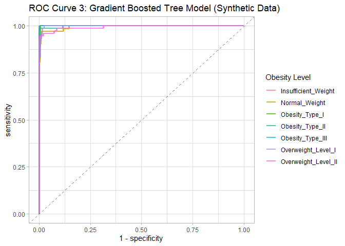<!-- -->

# Model 3.2 - Gradient Boosted Tree Model w/ Tuned Hyper-Parameters: Real Data (normal_df)

``` r
# Gradient Boosted Tree w/ Tuning
tune_gradient_boost_tree_model <- boost_tree(
    trees = tune(),
    learn_rate = tune(),
    tree_depth = tune(),
    sample_size = tune()
  ) %>% 
  set_mode("classification") %>% 
  set_engine("xgboost")

# Create tuning grid for hyper-parameters
gradient_tree_grid <- grid_random(extract_parameter_set_dials(tune_gradient_boost_tree_model), size = 30)

# Update workflow object with new model: tune_gradient_boost_tree_model
tree_workflow <- tree_workflow %>%
  update_model(tune_gradient_boost_tree_model)

# Tuning and resampling (cv)
tuning_gradient_tree_results <- tree_workflow %>% 
  tune_grid(resamples = normal_tree_folds,
            grid = gradient_tree_grid,
            metrics = tree_metrics)
```

    ## → C | warning: While computing multiclass `sens()`, some levels had no true events (i.e.
    ##                `true_positive + false_negative = 0`).
    ##                Sensitivity is undefined in this case, and those levels will be removed from
    ##                the averaged result.
    ##                Note that the following number of predicted events actually occurred for each
    ##                problematic event level:
    ##                'Obesity_Type_III': 1

    ## → G | warning: While computing multiclass `sens()`, some levels had no true events (i.e.
    ##                `true_positive + false_negative = 0`).
    ##                Sensitivity is undefined in this case, and those levels will be removed from
    ##                the averaged result.
    ##                Note that the following number of predicted events actually occurred for each
    ##                problematic event level:
    ##                'Insufficient_Weight': 0, 'Obesity_Type_II': 1

    ## → D | warning: While computing multiclass `sens()`, some levels had no true events (i.e.
    ##                `true_positive + false_negative = 0`).
    ##                Sensitivity is undefined in this case, and those levels will be removed from
    ##                the averaged result.
    ##                Note that the following number of predicted events actually occurred for each
    ##                problematic event level:
    ##                'Obesity_Type_II': 0, 'Obesity_Type_III': 1

``` r
tuning_gradient_tree_results %>% 
  collect_metrics(summarize = FALSE) %>% 
  filter(.metric == "roc_auc") %>% 
  group_by(id) %>% 
  summarize(min_roc_auc = min(.estimate),
            median_roc_auc = median(.estimate),
            max_roc_auc = max(.estimate))
```

    ## # A tibble: 10 × 4
    ##    id     min_roc_auc median_roc_auc max_roc_auc
    ##    <chr>        <dbl>          <dbl>       <dbl>
    ##  1 Fold01       0.886          0.946       0.959
    ##  2 Fold02       0.844          0.960       0.967
    ##  3 Fold03       0.818          0.888       0.905
    ##  4 Fold04       0.853          0.924       0.961
    ##  5 Fold05       0.941          0.961       0.967
    ##  6 Fold06       0.801          0.905       0.945
    ##  7 Fold07       0.896          0.927       0.966
    ##  8 Fold08       0.822          0.863       0.888
    ##  9 Fold09       0.848          0.900       0.923
    ## 10 Fold10       0.863          0.941       0.958

``` r
autoplot(tuning_gradient_tree_results)
```

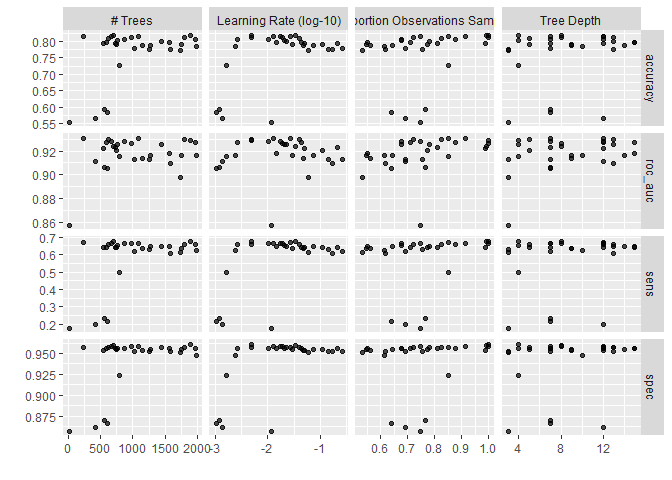<!-- -->

``` r
tuning_gradient_tree_results %>% 
  show_best(metric = 'roc_auc', n = 5)
```

    ## # A tibble: 5 × 10
    ##   trees tree_depth learn_rate sample_size .metric .estimator  mean     n std_err
    ##   <int>      <int>      <dbl>       <dbl> <chr>   <chr>      <dbl> <int>   <dbl>
    ## 1  1090          7    0.0128        0.913 roc_auc hand_till  0.931    10 0.00965
    ## 2   242         12    0.0265        0.850 roc_auc hand_till  0.931    10 0.00823
    ## 3   617          5    0.0402        0.826 roc_auc hand_till  0.930    10 0.00913
    ## 4  1794         13    0.00484       0.723 roc_auc hand_till  0.929    10 0.00988
    ## 5  1894          4    0.00494       0.999 roc_auc hand_till  0.929    10 0.0110 
    ## # ℹ 1 more variable: .config <chr>

``` r
# Top 5:
# trees   tree_depth  learn_rate  sample_size   .metric   .estimator    mean        n     std_err
# 1871    11            0.013749865 0.7860675       roc_auc   hand_till     0.9269546     10      0.009176586
# 898       12          0.003692208 0.8881136       roc_auc   hand_till     0.9268193     10      0.011009459
# 457       3             0.028356323   0.7688713       roc_auc   hand_till     0.9243418     10      0.009407939
# 1537    14            0.001700274 0.8570314       roc_auc   hand_till     0.9230048     10      0.011836180   
# 936       10          0.002553602 0.7410630       roc_auc   hand_till     0.9217199     10      0.012767880

# obtain mean roc_auc score
tuning_gradient_tree_results %>%
  show_best(metric = "roc_auc") %>%
  group_by(.metric) %>%
  summarize(mean = mean(mean))
```

    ## # A tibble: 1 × 2
    ##   .metric  mean
    ##   <chr>   <dbl>
    ## 1 roc_auc 0.930

``` r
# .metric   mean
# roc_auc   0.9296265       

best_tune_tree_model <- tuning_gradient_tree_results %>% 
  select_best(metric = 'roc_auc')

final_tune_tree_workflow <- tree_workflow %>% 
  finalize_workflow(best_tune_tree_model)

final_tune_tree_fit <- final_tune_tree_workflow %>% 
  last_fit(split = normal_df_split, metrics = tree_metrics)
```

    ## → A | warning: While computing multiclass `sens()`, some levels had no true events (i.e.
    ##                `true_positive + false_negative = 0`).
    ##                Sensitivity is undefined in this case, and those levels will be removed from
    ##                the averaged result.
    ##                Note that the following number of predicted events actually occurred for each
    ##                problematic event level:
    ##                'Obesity_Type_III': 0

    ## → B | warning: ✖ No observations were detected in `truth` for level: Obesity_Type_III.
    ##                ℹ Computation will proceed by ignoring those levels.

    ## There were issues with some computations   A: x1   B: x1There were issues with some computations   A: x1   B: x1

``` r
final_tune_tree_fit %>% 
  collect_metrics()
```

    ## # A tibble: 4 × 4
    ##   .metric  .estimator .estimate .config        
    ##   <chr>    <chr>          <dbl> <chr>          
    ## 1 accuracy multiclass     0.837 pre0_mod0_post0
    ## 2 sens     macro          0.695 pre0_mod0_post0
    ## 3 spec     macro          0.962 pre0_mod0_post0
    ## 4 roc_auc  hand_till      0.956 pre0_mod0_post0

``` r
# Tuned Gradient Boost Model Results
  # accuracy        multiclass    0.8372093
  # sens            macro           0.6825161
  # spec            macro           0.9610802
  # roc_auc       hand_till     0.9523730
```

# Model 3.2 - Gradient Boosted Tree Model w/ Tuned Hyper-Parameters: Synthetic Data (df)

``` r
# Gradient Boosted Tree w/ Tuning
tune_gradient_boost_tree_model <- boost_tree(
    trees = tune(),
    learn_rate = tune(),
    tree_depth = tune(),
    sample_size = tune()
  ) %>% 
  set_mode("classification") %>% 
  set_engine("xgboost")

# Create tuning grid for hyper-parameters
gradient_tree_grid <- grid_random(extract_parameter_set_dials(tune_gradient_boost_tree_model), size = 30)

# Update workflow object with new model: tune_gradient_boost_tree_model
tree_workflow <- tree_workflow %>%
  update_model(tune_gradient_boost_tree_model)

# Tuning and resampling (cv)
tuning_gradient_tree_results <- tree_workflow %>% 
  tune_grid(resamples = syn_tree_folds,
            grid = gradient_tree_grid,
            metrics = tree_metrics)

tuning_gradient_tree_results %>% 
  collect_metrics(summarize = FALSE) %>% 
  filter(.metric == "roc_auc") %>% 
  group_by(id) %>% 
  summarize(min_roc_auc = min(.estimate),
            median_roc_auc = median(.estimate),
            max_roc_auc = max(.estimate))
```

    ## # A tibble: 10 × 4
    ##    id     min_roc_auc median_roc_auc max_roc_auc
    ##    <chr>        <dbl>          <dbl>       <dbl>
    ##  1 Fold01       0.921          0.997       1.000
    ##  2 Fold02       0.939          0.999       0.999
    ##  3 Fold03       0.918          0.997       0.999
    ##  4 Fold04       0.924          0.999       1.000
    ##  5 Fold05       0.922          0.998       0.998
    ##  6 Fold06       0.933          0.999       1.000
    ##  7 Fold07       0.926          0.997       0.999
    ##  8 Fold08       0.935          1.000       1    
    ##  9 Fold09       0.932          0.998       0.999
    ## 10 Fold10       0.921          0.997       0.998

``` r
autoplot(tuning_gradient_tree_results)
```

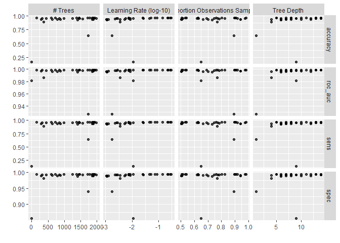<!-- -->

``` r
tuning_gradient_tree_results %>% 
  show_best(metric = 'roc_auc', n = 5)
```

    ## # A tibble: 5 × 10
    ##   trees tree_depth learn_rate sample_size .metric .estimator  mean     n std_err
    ##   <int>      <int>      <dbl>       <dbl> <chr>   <chr>      <dbl> <int>   <dbl>
    ## 1  1712         13     0.145        0.804 roc_auc hand_till  0.999    10 2.99e-4
    ## 2  1384          5     0.0260       0.907 roc_auc hand_till  0.999    10 2.86e-4
    ## 3  1911         13     0.0453       0.823 roc_auc hand_till  0.999    10 2.56e-4
    ## 4  1787         14     0.0765       0.506 roc_auc hand_till  0.999    10 3.02e-4
    ## 5  1938          8     0.224        0.760 roc_auc hand_till  0.999    10 2.84e-4
    ## # ℹ 1 more variable: .config <chr>

``` r
# Top 5:
# trees   tree_depth  learn_rate  sample_size   .metric   .estimator    mean        n     std_err
# 1041    6           0.02855801    0.6350682       roc_auc   hand_till     0.9988747     10      0.0002577269
# 1003    6           0.05915703    0.7647551       roc_auc   hand_till     0.9988500     10      0.0002855007
# 655       8             0.25178004    0.9765933       roc_auc   hand_till     0.9988047     10      0.0003078358
# 879       15          0.04603143  0.5071435       roc_auc   hand_till     0.9987901     10      0.0002968329
# 752       11          0.03238721  0.8381573       roc_auc   hand_till     0.9987422     10      0.0002720549

# obtain mean roc_auc score
tuning_gradient_tree_results %>%
  show_best(metric = "roc_auc") %>%
  group_by(.metric) %>%
  summarize(mean = mean(mean))
```

    ## # A tibble: 1 × 2
    ##   .metric  mean
    ##   <chr>   <dbl>
    ## 1 roc_auc 0.999

``` r
# .metric   mean
# roc_auc   0.9988123           

best_tune_tree_model <- tuning_gradient_tree_results %>% 
  select_best(metric = 'roc_auc')

final_tune_tree_workflow <- tree_workflow %>% 
  finalize_workflow(best_tune_tree_model)

final_tune_tree_fit <- final_tune_tree_workflow %>% 
  last_fit(split = syn_df_split, metrics = tree_metrics)

final_tune_tree_fit %>% 
  collect_metrics()
```

    ## # A tibble: 4 × 4
    ##   .metric  .estimator .estimate .config        
    ##   <chr>    <chr>          <dbl> <chr>          
    ## 1 accuracy multiclass     0.974 pre0_mod0_post0
    ## 2 sens     macro          0.972 pre0_mod0_post0
    ## 3 spec     macro          0.996 pre0_mod0_post0
    ## 4 roc_auc  hand_till      0.999 pre0_mod0_post0

``` r
# Tuned Gradient Boost Model Results
  # accuracy        multiclass    0.9716981
  # sens            macro           0.9704182
  # spec            macro           0.9952833
  # roc_auc       hand_till     0.9989265
```

# Model 4 - KNN: Real Data (normal_df)

``` r
#Create Recipe
knn_recipe <- recipe(NObeyesdad ~ ., data = normal_obesity_train) %>%
  step_novel(all_nominal_predictors(), new_level = "other") %>%
  step_dummy(all_nominal_predictors()) %>%
  step_zv(all_predictors()) %>%
  step_normalize(all_numeric_predictors())  

#Structure Model
knn_model <- nearest_neighbor(
  neighbors = tune(),   # this is k
  weight_func = "rectangular",
  dist_power = 2
) %>%
  set_engine("kknn") %>%
  set_mode("classification")

#Build workflow
knn_workflow <- workflow() %>%
  add_recipe(knn_recipe) %>%
  add_model(knn_model)

#Cross validation of k-NN model
#Check for best k-value and prints 20 k-values + accuracy
knn_grid <- tibble(neighbors = 1:20)
knn_tuned <- knn_workflow %>%
  tune_grid(
    resamples = normal_tree_folds,
    grid = knn_grid,
    metrics = tree_metrics
  )
```

    ## → C | warning: While computing multiclass `sens()`, some levels had no true events (i.e.
    ##                `true_positive + false_negative = 0`).
    ##                Sensitivity is undefined in this case, and those levels will be removed from
    ##                the averaged result.
    ##                Note that the following number of predicted events actually occurred for each
    ##                problematic event level:
    ##                'Obesity_Type_II': 0, 'Obesity_Type_III': 2

    ## → H | warning: While computing multiclass `sens()`, some levels had no true events (i.e.
    ##                `true_positive + false_negative = 0`).
    ##                Sensitivity is undefined in this case, and those levels will be removed from
    ##                the averaged result.
    ##                Note that the following number of predicted events actually occurred for each
    ##                problematic event level:
    ##                'Insufficient_Weight': 4, 'Obesity_Type_II': 1

    ## → I | warning: While computing multiclass `sens()`, some levels had no true events (i.e.
    ##                `true_positive + false_negative = 0`).
    ##                Sensitivity is undefined in this case, and those levels will be removed from
    ##                the averaged result.
    ##                Note that the following number of predicted events actually occurred for each
    ##                problematic event level:
    ##                'Insufficient_Weight': 2, 'Obesity_Type_II': 1

    ## → J | warning: While computing multiclass `sens()`, some levels had no true events (i.e.
    ##                 `true_positive + false_negative = 0`).
    ##                 Sensitivity is undefined in this case, and those levels will be removed from
    ##                 the averaged result.
    ##                 Note that the following number of predicted events actually occurred for each
    ##                 problematic event level:
    ##                 'Insufficient_Weight': 2, 'Obesity_Type_II': 0

    ## → D | warning: While computing multiclass `sens()`, some levels had no true events (i.e.
    ##                `true_positive + false_negative = 0`).
    ##                Sensitivity is undefined in this case, and those levels will be removed from
    ##                the averaged result.
    ##                Note that the following number of predicted events actually occurred for each
    ##                problematic event level:
    ##                'Obesity_Type_II': 0, 'Obesity_Type_III': 1

``` r
knn_tuned %>%
  collect_metrics() %>%
  filter(.metric == "accuracy") %>%
  select(k = neighbors, accuracy = mean)
```

    ## # A tibble: 20 × 2
    ##        k accuracy
    ##    <int>    <dbl>
    ##  1     1    0.521
    ##  2     2    0.521
    ##  3     3    0.554
    ##  4     4    0.569
    ##  5     5    0.588
    ##  6     6    0.603
    ##  7     7    0.596
    ##  8     8    0.583
    ##  9     9    0.585
    ## 10    10    0.585
    ## 11    11    0.575
    ## 12    12    0.572
    ## 13    13    0.572
    ## 14    14    0.570
    ## 15    15    0.567
    ## 16    16    0.565
    ## 17    17    0.565
    ## 18    18    0.557
    ## 19    19    0.562
    ## 20    20    0.557

``` r
# obtain mean roc_auc score
knn_tuned %>%
  show_best(metric = "roc_auc") %>%
  group_by(.metric) %>%
  summarize(mean = mean(mean))
```

    ## # A tibble: 1 × 2
    ##   .metric  mean
    ##   <chr>   <dbl>
    ## 1 roc_auc 0.694

``` r
# .metric   mean
# roc_auc   0.6937371   

# Creates plot for k-values vs Accuracy
knn_tuned %>%
  collect_metrics() %>%
  filter(.metric == "accuracy") %>%
  ggplot(aes(neighbors, mean)) +
  geom_line() +
  geom_point() +
  labs(title = "KNN Accuracy vs K", x = "k", y = "Accuracy")
```

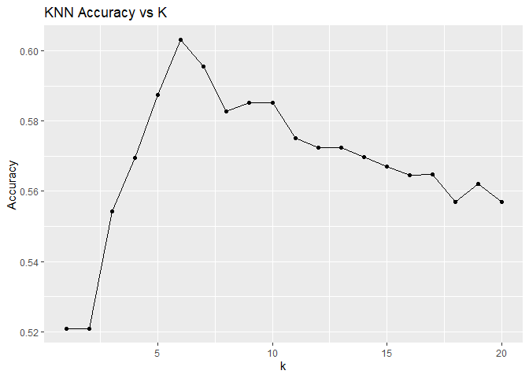<!-- -->

``` r
#Finalize k-NN
best_knn <- knn_tuned %>%
  select_best(metric = "accuracy")

final_knn_workflow <- knn_workflow %>%
  finalize_workflow(best_knn)

best_knn
```

    ## # A tibble: 1 × 2
    ##   neighbors .config         
    ##       <int> <chr>           
    ## 1         6 pre0_mod06_post0

``` r
#Test Performance
final_knn_fit <- final_knn_workflow %>%
  last_fit(split = normal_df_split, metrics = tree_metrics)
```

    ## → A | warning: package 'kknn' was built under R version 4.5.3

    ## There were issues with some computations   A: x1                                                 → B | warning: While computing multiclass `sens()`, some levels had no true events (i.e.
    ##                `true_positive + false_negative = 0`).
    ##                Sensitivity is undefined in this case, and those levels will be removed from
    ##                the averaged result.
    ##                Note that the following number of predicted events actually occurred for each
    ##                problematic event level:
    ##                'Obesity_Type_III': 0
    ## There were issues with some computations   A: x1                                                 → C | warning: ✖ No observations were detected in `truth` for level: Obesity_Type_III.
    ##                ℹ Computation will proceed by ignoring those levels.
    ## There were issues with some computations   A: x1There were issues with some computations   A: x2   B: x1   C: x1There were issues with some computations   A: x2   B: x1   C: x1

``` r
final_knn_fit %>%
  collect_metrics()
```

    ## # A tibble: 4 × 4
    ##   .metric  .estimator .estimate .config        
    ##   <chr>    <chr>          <dbl> <chr>          
    ## 1 accuracy multiclass     0.597 pre0_mod0_post0
    ## 2 sens     macro          0.260 pre0_mod0_post0
    ## 3 spec     macro          0.891 pre0_mod0_post0
    ## 4 roc_auc  hand_till      0.644 pre0_mod0_post0

``` r
# KNN Results
# accuracy  multiclass  0.5968992
# sens      macro         0.2596267
# spec      macro         0.8908521     
# roc_auc     hand_till   0.6443231
```

# Model 4 - KNN: Synthetic Data (df)

``` r
#Create Recipe
knn_recipe <- recipe(NObeyesdad ~ ., data = syn_obesity_train) %>%
  step_novel(all_nominal_predictors(), new_level = "other") %>%
  step_dummy(all_nominal_predictors()) %>%
  step_zv(all_predictors()) %>%
  step_normalize(all_numeric_predictors())  

#Structure Model
knn_model <- nearest_neighbor(
  neighbors = tune(),   # this is k
  weight_func = "rectangular",
  dist_power = 2
) %>%
  set_engine("kknn") %>%
  set_mode("classification")

#Build workflow
knn_workflow <- workflow() %>%
  add_recipe(knn_recipe) %>%
  add_model(knn_model)

#Cross validation of k-NN model
#Check for best k-value and prints 20 k-values + accuracy
knn_grid <- tibble(neighbors = 1:20)
knn_tuned <- knn_workflow %>%
  tune_grid(
    resamples = syn_tree_folds,
    grid = knn_grid,
    metrics = tree_metrics
  )

knn_tuned %>%
  collect_metrics() %>%
  filter(.metric == "accuracy") %>%
  select(k = neighbors, accuracy = mean)
```

    ## # A tibble: 20 × 2
    ##        k accuracy
    ##    <int>    <dbl>
    ##  1     1    0.804
    ##  2     2    0.804
    ##  3     3    0.788
    ##  4     4    0.787
    ##  5     5    0.772
    ##  6     6    0.771
    ##  7     7    0.766
    ##  8     8    0.766
    ##  9     9    0.766
    ## 10    10    0.759
    ## 11    11    0.751
    ## 12    12    0.740
    ## 13    13    0.734
    ## 14    14    0.732
    ## 15    15    0.729
    ## 16    16    0.721
    ## 17    17    0.715
    ## 18    18    0.711
    ## 19    19    0.707
    ## 20    20    0.703

``` r
# obtain mean roc_auc score
knn_tuned %>%
  show_best(metric = "roc_auc") %>%
  group_by(.metric) %>%
  summarize(mean = mean(mean))
```

    ## # A tibble: 1 × 2
    ##   .metric  mean
    ##   <chr>   <dbl>
    ## 1 roc_auc 0.942

``` r
# .metric   mean
# roc_auc     0.9416791             

# Creates plot for k-values vs Accuracy
knn_tuned %>%
  collect_metrics() %>%
  filter(.metric == "accuracy") %>%
  ggplot(aes(neighbors, mean)) +
  geom_line() +
  geom_point() +
  labs(title = "KNN Accuracy vs K", x = "k", y = "Accuracy")
```

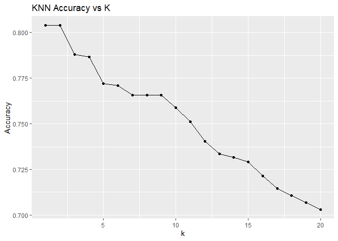<!-- -->

``` r
#Finalize k-NN
best_knn <- knn_tuned %>%
  select_best(metric = "accuracy")

final_knn_workflow <- knn_workflow %>%
  finalize_workflow(best_knn)

best_knn
```

    ## # A tibble: 1 × 2
    ##   neighbors .config         
    ##       <int> <chr>           
    ## 1         1 pre0_mod01_post0

``` r
#Test Performance
final_knn_fit <- final_knn_workflow %>%
  last_fit(split = syn_df_split, metrics = tree_metrics)

final_knn_fit %>%
  collect_metrics()
```

    ## # A tibble: 4 × 4
    ##   .metric  .estimator .estimate .config        
    ##   <chr>    <chr>          <dbl> <chr>          
    ## 1 accuracy multiclass     0.808 pre0_mod0_post0
    ## 2 sens     macro          0.804 pre0_mod0_post0
    ## 3 spec     macro          0.968 pre0_mod0_post0
    ## 4 roc_auc  hand_till      0.886 pre0_mod0_post0

``` r
# KNN Results
# accuracy  multiclass  0.8075472
# sens      macro         0.8037989
# spec      macro         0.9680202     
# roc_auc     hand_till   0.8855494
```
